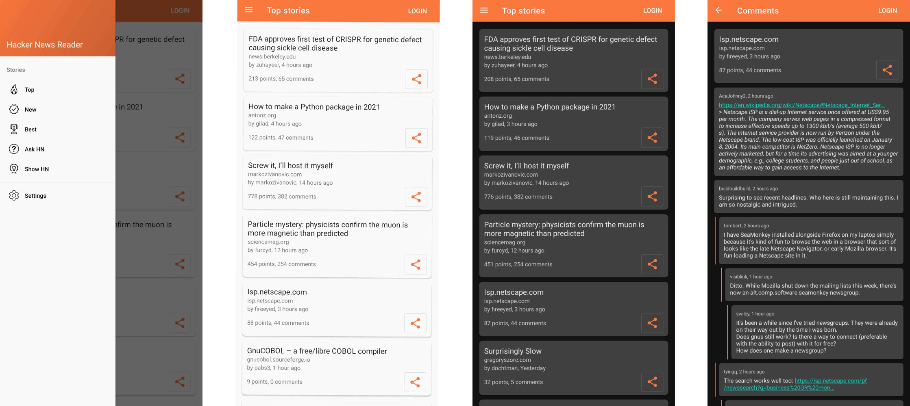

# HNReader

Hacker News client for Android written in Kotlin

## What does it do?

Our app is a client for news' website and forum [Hacker News](https://news.ycombinator.com/). It displays posts from 6 different lists, displays the post's comments in a different view, and lets the user bookmark either posts or comments.

## Who is the user?

Our app is accessible for any type of user interested in reading software or tech-related news.

### Team 4

- Mario Emilio Jiménez Vizcaíno A01173359
- Kevin Torres Martínez A01656257
